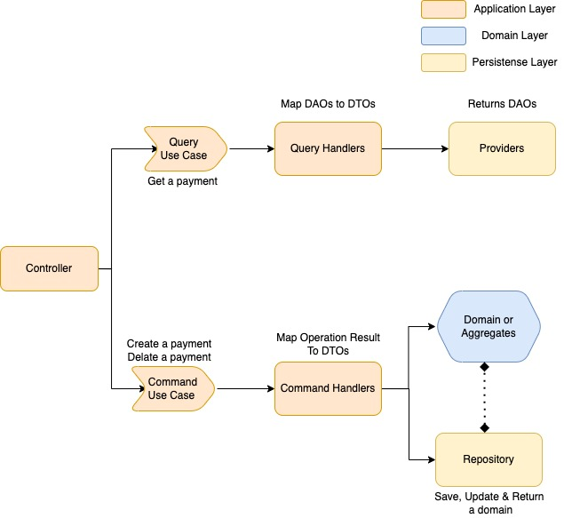

# Architecture 

We followed the design principles of clean architecture, DDD along with goodness of CQRS.

[image src](https://blog.cleancoder.com/uncle-bob/2012/08/13/the-clean-architecture.html)

As described in the above diagram, there are clear mention of different sections and their responsibilities.
To have a better understanding of Clean Architecture, DDD and rational behind adding CQRS along with clean architecture and DDD, please go through following links.

* **Clean Architecture**
  * https://blog.cleancoder.com/uncle-bob/2012/08/13/the-clean-architecture.html
  * https://github.com/mattia-battiston/clean-architecture-example
  * https://www.youtube.com/watch?v=o_TH-Y78tt4&ab_channel=NorfolkDevelopers
* **DDD**
  * https://2017.dddeurope.com/speakers/udi-dahan/
  * https://martinfowler.com/bliki/DomainDrivenDesign.html
  * https://www.domainlanguage.com/ddd/
* **CQRS**
  * https://udidahan.com/2009/12/09/clarified-cqrs/
* **Clean Architecture, DDD & CQRS**
  * https://groups.google.com/g/clean-code-discussion/c/oEFEWq8qdFQ/m/i0gsi3eU5VoJ
  * https://blog.jacobsdata.com/2020/02/19/a-brief-intro-to-clean-architecture-clean-ddd-and-cqrs

So, after going through above links and having basic understanding of high level concepts brought in my shared blogs, we can say that.. 
* **Clean Architecture**
  * It talks about how to define vertical boundaries within our code base and apply very neat separation of concerns.
* **DDD**
  * It advocates about how to model the domain entities encapsulating intra-aggregate invariants and behaviours
* **CQRS**
  * Help to see create/update operations differently from query operations   
  * It is not always about event sourcing and having a separate database

## System Design Considerations
* We have designed our application with Clean Architecture infused with DDD advocacy. In a way `Clean DDD`
* We have also brought concepts from CQRS to break Application Services  (a.k.a. UseCase Service) into smaller operation level classes in the form of commands and queries.
  * **Command** will be a complex operation which will change the system state and will involve domain and repository
  * **Query** will be for read operation, which doesn't change any state of the system
  * **Why we choose it:**
    * Over the lifetime `Application Service` go thicker and thicker and start doing lots of operations on the aggregates.
    * Too many reason to update this class
    * Hard to refactor and hard to have clean unit tests
    * With command/ query pattern, we break this monolithic class into a smaller functional unit of an operation and thus leads to smaller, easy to manage and clear objective classes
  * Let's explore below diagram to understand more on these segregation.
    * 
    * As above diagram suggests that there are two very separate execution path for different type of operations. 
    * These operations are different in nature and are of two types.
      * **Query**
        * A read operation and doesn't require business domain 
        * Handler will orchestrate required steps for a given operation
        * Provider is a abstraction over database and returns DAO (data access objects)
        * DAO maps to DTO through AutoMapper
        * Refer [BankByIdQuery](../src/{{cookiecutter.ProjectName}}.Api/Operation/Query/BankByIdQuery.cs) & [BankByIdQueryHandler](../src/{{cookiecutter.ProjectName}}.Api/Operation/Query/BankByIdQueryHandler.cs)
      * **Command**
        * A system state change operation and does require interaction with business domain and repositories
        * Handler will orchestrate required steps for a given operation to fulfill a behaviour on the domain
        * Perform business operation on domain 
        * Persist the domain through repository
        * Map response to DTO
        * Refer [Create{{cookiecutter.ProjectName}}Command](../src/{{cookiecutter.ProjectName}}.Api/Operation/Command/Create{{cookiecutter.ProjectName}}Command.cs) & [Create{{cookiecutter.ProjectName}}CommandHandler](../src/{{cookiecutter.ProjectName}}.Api/Operation/Command/Create{{cookiecutter.ProjectName}}CommandHandler.cs)

  

  